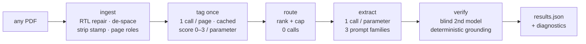

# Tender Parameter Extraction — page-level structured routing

Extracts a configurable set of parameters from long Hebrew tender documents (מכרזים) — any tender
PDF with a text layer, not a specific one. For each parameter it returns the value, an explanation,
the source pages, and a 1–5 certainty score.

```
PDF ─▶ pages ─▶ lexical prefilter ─▶ tag each page ─▶ route ─▶ extract ─▶ verify ─▶ output
```

Nothing document-specific lives in the code: parameters, keywords, and page budgets come from
`param_config.json` (with defaults for parameters it has never seen), and every structural
assumption about a document — does it have a running header? where is its cover? — is **detected
per document behind a gate**, never hard-coded. Two labeled tenders and three unlabeled ones were
used to build and test it; they appear below strictly as worked examples.

## Why not just send the whole PDF? (the naive baseline)

The naive approach — paste the full document into the prompt, once per parameter — works, and it is
the measured baseline here (`--ablation`). Routing beats it on every axis that matters at scale:

| | naive: whole PDF × N parameters | this pipeline: tag once, route |
|---|---|---|
| tokens, 7 params, ~80-page doc | **568,189** | **214,676** (−62%) — measured |
| tokens per *added* parameter | +~81,000 (full doc again) | +~3,500 (routed pages only) |
| break-even | — | from the **3rd parameter** onward |
| re-runs on the same document | full price every time | tags cached → extraction only (~24k) |
| citations | "somewhere in the document" | page-level `source`, verified verbatim quote |
| long documents | hits the context window | never sends more than a few pages per call |
| needle-in-haystack accuracy | degrades with length | each call reads only relevant pages |
| failure visibility | one opaque mega-answer | per-page tags, per-parameter routing — inspectable |

The economics compound: tagging is paid **once per document** and reused by every parameter —
including parameters added later, which route with **zero** new document reads. The naive baseline
pays for the whole document on every question, forever.

## Running it

```bash
pip install -r requirements.txt
echo "GEMINI_API_KEY=your_key" > .env        # and/or ANTHROPIC_API_KEY=...

python solution.py --pdf path/to/any_tender.pdf              # any tender PDF
python solution.py --ablation                                # routed vs whole-document cost
python solution.py --provider anthropic                      # Claude instead of Gemini

streamlit run app.py                # web UI: upload any PDF + the Monitoring tab
```

Outputs land in `output/`: `results.json` (the required contract), `page_map.json`
(`parameter → [pages]`), `diagnostics.json` (metrics kept out of the contract), and
`runs.jsonl` — one line per run, appended automatically (see Monitoring).

## 1 · EDA — read the document before the model does

The pipeline's first move on **any** PDF is deterministic measurement — no LLM, no cost: page
sizes, repeated lines, keyword reachability, page roles. The architecture exists because those
measurements vary wildly *between* tenders, so every structural choice is detected per document.
Example measurements from the two labeled tenders (used here only as illustration — the same probes
run on any input):

| measured on any PDF | example A (81 p) | example B (46 p) | decision it forced |
|---|---:|---:|---|
| repeated stamp | 8 lines · 100% of pages · **8.9% of chars** | **none** (0.2%) | strip the stamp, promote it to metadata — behind a gate (`has_running_header`), never as an assumption |
| median page | 2,054 chars | 1,916 chars | a page ≈ 600–750 tokens → the **page is the retrieval unit**, no chunking layer to tune |
| broad-parameter keyword hits | 69/81 pages (85%) | 43/46 (93%) | keywords saturate legal Hebrew → recall-only prefilter; routing authority is a per-page LLM tagger |
| narrow-parameter keyword hits | 7/81 | 9/46 | …but keywords stay: for narrow parameters they carry real signal |
| where answers live | first quarter | first quarter | page-role bonus (`body +0.3 · appendix −0.4`): appendices restate answers inside blank forms |

```
pages     1 ·········· 18 ····································· 64 ·········· 81
answers   ██████████████                                          ·
roles     C bbbbbbbbbbbbbbbbbbbbbbbbbbbbbbbbbbbbbbbb aaaaaaaaaaaaaaaaa f
          (example A · C cover · b body · a appendix · f form)
```
  
Two extraction defects common to Hebrew PDFs are repaired at ingest, where every later stage
benefits: **visual-order RTL** (detected by majority vote over the final-letters invariant `ךםןףץ`)
and **letter-spaced type** — `ה ז מ נ ה` → `הזמנה`, closed per page once a page proves itself
tracked-out. Left unrepaired, a spaced page is invisible to the prefilter, to header detection, and
to the grounding check.

## 2 · Architecture



The load-bearing choices:

- **Tag once, route many.** The expensive judgment (one call per page) is bought once, cached by
  `(page content, prompt_version, model)`, and reused by every parameter — including ones added
  later. Measured on example A: **2.86 pages sent per parameter** out of 81.
- **Structure is detected, not assumed.** Running header, cover page, table-of-contents,
  appendix boundaries — each found by content per document. A stamp qualifies as a header only if
  it recurs (≥40% of pages) *and* names the tender/publisher; otherwise metadata parameters route
  by relevance like everything else (2 of the 5 tenders surveyed have no stamp at all).
- **Three prompt families serve any parameter set** (`metadata` / `atomic` / `list_or_table`);
  adding a parameter is a config entry, not a new prompt.
- **Verification is layered and cheap-first.** A deterministic grounding check (exact substring →
  word overlap → letters-only) that cannot hallucinate, then a blind cross-family second model.
  The model proposes the 1–5 score; evidence caps it — an unverified answer caps at 1. The pipeline
  refuses confidence it did not earn.
- **A confident "not found" is a correct answer** and scores high. A *failed call* is an error in
  `extraction_errors`, never disguised as an absence; `absence_contested` flags "extractor says
  absent, tagger scored the page 3" — the signal separating *not found* from *couldn't find*.
- **No LangChain.** Prompt templates are f-strings, output parsing is native schema-constrained
  generation, chains are functions. Nothing is imported that cannot be explained.

## 3 · Monitoring

Every run — CLI, Streamlit, or comparison driver, on any document — appends one line to
`output/runs.jsonl` (`record_run()` inside `process_document`, so nobody has to remember to log):

```json
{"ts":"2026-08-26T17:36:00","pdf":"tender_sample.pdf","provider":"local",
 "extractor":"mistralai/ministral-3-3b","elapsed_s":126.0,"avg_pages":3.0,
 "found":6,"grounded":6,"score_total":33,"llm_calls":95,"cache_hits":81,
 "input_tokens":249499,"output_tokens":27840,"errors":0,"results":{"...":"..."}}
```

The Streamlit app's **📊 Monitoring** tab reads it and charts KPIs over time — found & grounded per
run, avg pages/parameter, tokens, calls vs cache — with a per-run drill-down to every answer.
Append-only JSONL: a crashed run leaves no line, never a torn file.

## 4 · Model comparison

The provider is a seam: any OpenAI-compatible, Gemini, or Anthropic endpoint slots in via
`PROVIDER_MODELS`. Example — the same pipeline on the same document, verdicts by the project's own
matcher against the reference sheet:

| provider | model | correct | grounded | runtime | tokens in | conditions |
|---|---|---|---|---:|---:|---|
| **Gemini** | gemini-2.5-flash | **7/7** `███████` | 6/7 | ~4–9 min cold · sec warm | 25,458 | free tier — runtime is rate-limit backoff, not compute · judge quota-silenced on 5/7, so scores under-report |
| **Anthropic** | claude-opus-5 | **7/7** `███████` | 6/7 | **152 s** cold | 376,098 | paid · full verification — the reference run |
| **local** | ministral-3-3b | **5/7** `█████░░` | 6/7 | **126 s** (tags cached) | 249,499 | consumer laptop, fully offline · misses only the evaluation weights |

```
runtime   Anthropic (cold)   ██████████░░░░░░░░░░░░░░░░░   152 s
          local (tags cached)████████░░░░░░░░░░░░░░░░░░░   126 s
          Gemini free (cold) ███████████████████████████   4–9 min — backoff, not compute
```

Runtime is a property of the *tier*, not the model: the paid API is compute-bound (~2.5 min cold),
the free tier is quota-bound (most of the wall clock is backoff), and the local model sits between —
with zero marginal cost and no network. Warm re-runs on any provider replay cached tags and drop to
the cost of 14 extraction/judge calls.

**Groundedness** is the deterministic check — is the model's verbatim quote actually on the pages
its `source` cites? All three providers ground **6 of 7** answers; the seventh is the verified
absence, which has no quote to check by design. Tier breakdown (example, holdout audit): 3 answers
ground by **exact substring**, 2 by **word overlap ≥ 0.8**, 1 only at the **letters-only** tier —
the evaluation-matrix section whose spacing extracts messily, which is precisely the case that tier
exists for. Equal 6/7 scores hide unequal *strictness*, which is why the tier is worth reporting.

Two findings the comparison produced, worth more than the table:

- **One required field doubled the local model's result.** With Pydantic defaults on every schema
  field, a model that omits `status` gets `"not_found"` filled in and its answer silently discarded.
  ministral jumped **4/7 → 6/7 found, 2/7 → 6/7 grounded** when the harness marked all fields
  required — the one-line fix (`status: str = Field(...)`) is the top roadmap item.
- **Neighbour-context ablation** (Anthropic vs itself): tagging each page alone instead of with
  200-char neighbour context → identical answers, minor routing drift to alternate pages,
  **−7.5% input tokens**. Context is insurance the example document never claimed; it stays until a
  tender with a page-straddling answer says otherwise.

Four more models were tested and failed for four *different*, diagnosed reasons — Groq free-tier
quota (org-wide), Llama-3.1-8B refusing to commit (`absence_contested` caught all six false
absences), qwen3.5-9B's serving stack corrupting constrained output, gemma-4-12B's 15 tok/s ×
verbose JSON ≈ hours. Full seven-model matrix: `output/provider_comparison_final.html` · clean
three-way: `output/provider_comparison_3way.html`.

## Honest limitations

- **The run comparison is textual.** The blind second run is compared deterministically by
  normalized containment / token overlap — it can under-call a heavy paraphrase as `partial`.
- **n=2 labeled documents.** Structural behaviour is verified on five tenders; the *correctness*
  claim rests on the two with reference answers. Label-free metrics (groundedness, pages-sent,
  negative control) run on any document.
- **Not-found scoring follows the spec's prose, not its example** (a verified absence scores high);
  if the example is authoritative, the change is confined to `final_score()`.
- **Free-tier quota shapes the runtime.** Cold runs are minutes of backoff, not compute; warm runs
  are seconds. Judge calls are the first casualty — correct answers can carry score 1 (see the
  Gemini row above).
- **Scanned PDFs and heavy tables are out of scope** and stated as such: no text layer → no answer;
  table pages extract as positioned text soup.

## Layout

```
solution.py             the whole pipeline, main() calling small functions
app.py                  Streamlit UI: extraction + Monitoring tab
build_comparison.py     renders provider comparisons from recorded runs (never recomputes)
param_config.json       per-parameter gazetteer, prompt family, page budget
data/                   example tenders, their parameters.json, reference answers
output/                 results, page map, diagnostics, tag cache, runs.jsonl, comparison pages
PLAN.md · REVIEW.md     architecture log · adversarial self-review
```

No page numbers, document-specific regexes or tuned constants live in the functions — everything
document-specific is in `param_config.json`, which falls back to a default for parameters it has
never seen.
