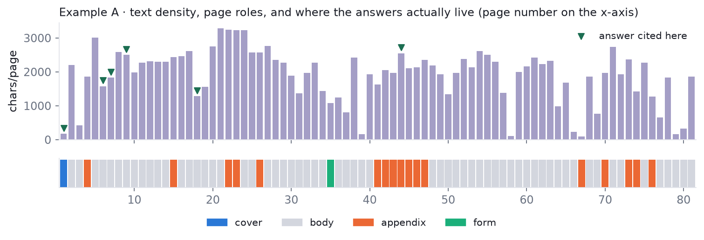
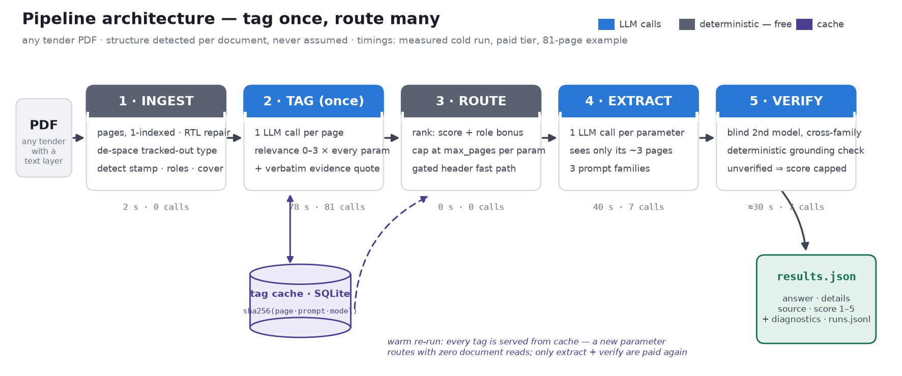
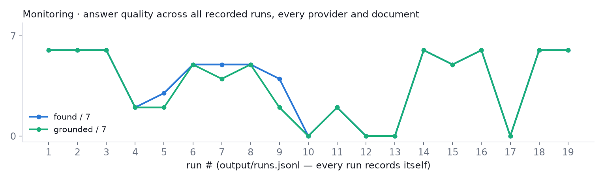
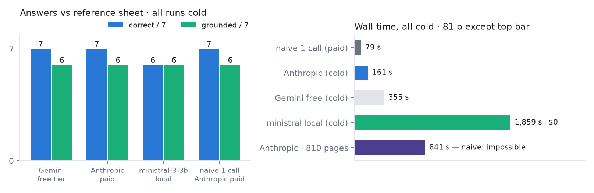
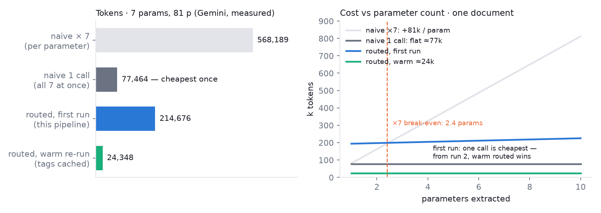
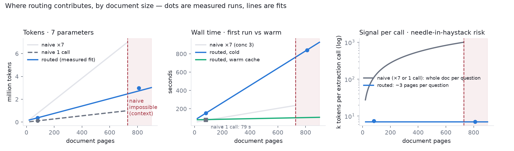

# Tender Parameter Extraction — page-level structured routing

Extracts a configurable set of parameters from long Hebrew tender documents (מכרזים) — any tender
PDF with a text layer, not a specific one. For each parameter it returns the value, an explanation,
the source pages, and a 1–5 certainty score.

```
PDF ─▶ pages ─▶ lexical prefilter ─▶ tag each page ─▶ route ─▶ extract ─▶ verify ─▶ output
```

Nothing document-specific lives in the code: parameters, keywords, and page budgets come from
`param_config.json` (with defaults for parameters it has never seen), and every structural
assumption about a document — does it have a running header? where is its cover? — is **detected
per document behind a gate**, never hard-coded. Two labeled tenders and three unlabeled ones were
used to build and test it; they appear below strictly as worked examples.

## The problem, and the intuition behind the design

There are three ways to ask an LLM seven questions about an 80-page document:

**One call, whole document, all seven questions.** The cheapest possible first answer — one
document read, ever. But it stacks seven needles into one haystack: every question competes for
the model's attention across ~80k tokens, one bad generation entangles all seven answers, and
there is no per-parameter trail — no page map, no isolated failure, no way to say *which pages
answered which question*. And it stops existing at scale: a document larger than the context
window cannot be asked at all, no matter how many questions ride the prompt.

**Seven calls, whole document each.** Isolating the questions fixes the attention problem — each
call hunts one needle. The price is paying for the entire document seven times, on every run,
forever; and the haystack per question is still the whole document.

**This pipeline: read structurally once, then ask narrowly.** Tag every page once with a cheap
model (what does this page contain, per parameter?), cache those tags, route each question to the
~3 pages that can answer it, and extract from only those. The intuition: **accuracy comes from
shrinking the haystack, economy comes from amortizing the read, and auditability comes from the
page being the unit** — every answer carries the pages it came from and a verbatim quote that can
be checked without a model.

The intuitions are cheap to state; all three approaches are **measured head-to-head** — tokens,
time, accuracy, on two providers — in [Results](#5--results-ii-vs-the-naive-baselines) at the end,
where a genuine surprise about which approach wins *when* is reported rather than smoothed over.

## Running it

```bash
pip install -r requirements.txt
echo "GEMINI_API_KEY=your_key" > .env        # and/or ANTHROPIC_API_KEY=...

python solution.py --pdf path/to/any_tender.pdf              # any tender PDF
python solution.py --provider anthropic                      # Claude instead of Gemini

streamlit run app.py                # web UI: upload any PDF + the Monitoring tab
```

Without any API key the pipeline still runs end-to-end on a **stub provider** (no LLM calls,
empty answers) — useful for testing the plumbing, and announced loudly on the console.

Outputs land in `output/`: `results.json` (the required contract), `page_map.json`
(`parameter → [pages]`), `diagnostics.json` (metrics kept out of the contract), and
`runs.jsonl` — one line per run, appended automatically (see Monitoring). The folder starts
empty; the first run creates everything.

## 1 · EDA — read the document before the model does

The pipeline's first move on **any** PDF is deterministic measurement — no LLM, no cost: page
sizes, repeated lines, keyword reachability, page roles. The architecture exists because those
measurements vary wildly *between* tenders, so every structural choice is detected per document.
Example measurements from the two labeled tenders (used here only as illustration — the same probes
run on any input):

| measured on any PDF | example A (81 p) | example B (46 p) | decision it forced |
|---|---:|---:|---|
| repeated stamp | 8 lines · 100% of pages · **8.9% of chars** | **none** (0.2%) | strip the stamp, promote it to metadata — behind a gate (`has_running_header`), never as an assumption |
| median page | 2,054 chars | 1,916 chars | a page ≈ 600–750 tokens → the **page is the retrieval unit**, no chunking layer to tune |
| broad-parameter keyword hits | 69/81 pages (85%) | 43/46 (93%) | keywords saturate legal Hebrew → recall-only prefilter; routing authority is a per-page LLM tagger |
| narrow-parameter keyword hits | 7/81 | 9/46 | …but keywords stay: for narrow parameters they carry real signal |
| where answers live | first quarter | first quarter | page-role bonus (`body +0.3 · appendix −0.4`): appendices restate answers inside blank forms |



Two extraction defects common to Hebrew PDFs are repaired at ingest, where every later stage
benefits: **visual-order RTL** (detected by majority vote over the final-letters invariant `ךםןףץ`)
and **letter-spaced type** — `ה ז מ נ ה` → `הזמנה`, closed per page once a page proves itself
tracked-out. Left unrepaired, a spaced page is invisible to the prefilter, to header detection, and
to the grounding check.

## 2 · Architecture



The load-bearing choices:

- **Tag once, route many.** The expensive judgment (one call per page) is bought once, cached by
  `(page content, prompt_version, model)`, and reused by every parameter — including ones added
  later. Measured on example A: **2.86 pages sent per parameter** out of 81.
- **Structure is detected, not assumed.** Running header, cover page, table-of-contents,
  appendix boundaries — each found by content per document. A stamp qualifies as a header only if
  it recurs (≥40% of pages) *and* names the tender/publisher; otherwise metadata parameters route
  by relevance like everything else (2 of the 5 tenders surveyed have no stamp at all).
- **Three prompt families serve any parameter set** (`metadata` / `atomic` / `list_or_table`);
  adding a parameter is a config entry, not a new prompt.
- **Verification is layered and cheap-first.** A deterministic grounding check (exact substring →
  word overlap → letters-only) that cannot hallucinate, then a blind cross-family second model.
  The model proposes the 1–5 score; evidence caps it — an unverified answer caps at 1. The pipeline
  refuses confidence it did not earn.
- **A confident "not found" is a correct answer** and scores high. A *failed call* is an error in
  `extraction_errors`, never disguised as an absence; `absence_contested` flags "extractor says
  absent, tagger scored the page 3" — the signal separating *not found* from *couldn't find*.
- **No LangChain.** Prompt templates are f-strings, output parsing is native schema-constrained
  generation, chains are functions. Nothing is imported that cannot be explained.

## 3 · Monitoring

Every run — CLI, Streamlit, or comparison driver, on any document — appends one line to
`output/runs.jsonl` (`record_run()` inside `process_document`, so nobody has to remember to log):

```json
{"ts":"2026-08-27T11:38:27","pdf":"tender_sample.pdf","provider":"local",
 "extractor":"mistralai/ministral-3-3b","elapsed_s":1858.6,"avg_pages":3.0,
 "found":6,"grounded":6,"score_total":33,"llm_calls":95,"cache_hits":0,
 "input_tokens":242116,"output_tokens":50096,"errors":0,"results":{"...":"..."}}
```



The Streamlit app's **📊 Monitoring** tab reads it and charts KPIs over time — found & grounded per
run, avg pages/parameter, tokens, calls vs cache — with a per-run drill-down to every answer.
Append-only JSONL: a crashed run leaves no line, never a torn file.

## 4 · Results I — model comparison

The provider is a seam: any OpenAI-compatible, Gemini, or Anthropic endpoint slots in via
`PROVIDER_MODELS`. Same pipeline, same document, verdicts by the project's own matcher against the
reference sheet. All three rows are **cold runs — no tag cache, full verification** — so the
comparison is apples to apples; warm re-runs on any provider drop to seconds–80 s.

| provider | model | correct | grounded | runtime (cold) | tokens in | conditions |
|---|---|---|---|---:|---:|---|
| **Gemini** | gemini-2.5-flash | **7/7** `███████` | 6/7 | **355 s** | 208,225 | free tier — wall time includes rate-limit pacing |
| **Anthropic** | claude-opus-5 | **7/7** `███████` | 6/7 | **161 s** | 373,518 | paid — compute-bound |
| **local** | ministral-3-3b | **6/7** `██████░` | 6/7 | **1,859 s** | 242,116 | consumer laptop, fully offline, $0 — thresholds partial, all else correct |



Runtime is a property of the *tier*, not the model: the paid API is compute-bound (~2.5 min cold),
the free tier is quota-bound (355 s on a fresh-quota day, multiples of that when backoff kicks in),
and the local model pays laptop token rates cold (~31 min, nearly all tagging) in exchange for
zero marginal cost and no network. Warm re-runs on any provider replay cached tags and drop to the
cost of 14 extraction/judge calls.

**Groundedness** is the deterministic check — is the model's verbatim quote actually on the pages
its `source` cites? All three providers ground **6 of 7** answers; the seventh is the verified
absence, which has no quote to check by design. Tier breakdown (example, holdout audit): 3 answers
ground by **exact substring**, 2 by **word overlap ≥ 0.8**, 1 only at the **letters-only** tier —
the evaluation-matrix section whose spacing extracts messily, which is precisely the case that tier
exists for. Equal 6/7 scores hide unequal *strictness*, which is why the tier is worth reporting.

Three findings the comparison produced, worth more than the table:

- **One required field doubled the local model's result.** With Pydantic defaults on every schema
  field, a model that omits `status` gets `"not_found"` filled in and its answer silently discarded.
  ministral jumped **4/7 → 6/7 found, 2/7 → 6/7 grounded** when the harness marked all fields
  required — and a fully cold rerun confirmed it: **6/7 correct** with the evaluation weights right,
  its best result. The one-line fix (`status: str = Field(...)`) is the top roadmap item.
- **Neighbour-context ablation** (Anthropic vs itself): tagging each page alone instead of with
  200-char neighbour context → identical answers, minor routing drift to alternate pages, and
  **7.0% fewer input tokens** (adding context costs +7.5% over the bare-page baseline). Context is
  insurance the example document never claimed; it stays until a tender with a page-straddling
  answer says otherwise.
- **Prompt-language ablation** (Anthropic, both runs cold, same day): the same pipeline with its
  instruction scaffolding translated to **English** — document text, parameter definitions, and
  schemas unchanged, answers still required in Hebrew — produced **identical results** (7/7 correct,
  6/7 grounded, identical scores) at **−8.2% input tokens** and the same wall time. Prompt language
  is a **cost knob, not a quality knob**: Hebrew is token-expensive and the instructions repeat on
  all ~95 calls, so English scaffolding trims exactly that overhead. Caveats: one document, one
  provider; a weaker model might not read cross-language instructions this cleanly.

Four more models were tested and failed for four *different*, diagnosed reasons — Groq free-tier
quota (org-wide), Llama-3.1-8B refusing to commit (`absence_contested` caught all six false
absences), qwen3.5-9B's serving stack corrupting constrained output, gemma-4-12B's 15 tok/s ×
verbose JSON ≈ hours.

## 5 · Results II — vs the naive baselines

The intuitions from the opening section, now paid for. Three approaches, two providers, one
document — measured unless marked:

| | Gemini · 1 call | Gemini · ×7 | **Gemini · routed** | Anthropic · 1 call | Anthropic · ×7 | **Anthropic · routed** |
|---|---:|---:|---:|---:|---:|---:|
| correct | 5/7 | 6/7 | **7/7** | 7/7 | *not measured (~$12)* | **7/7** |
| grounded | 6/7 | 6/7 | 6/7 | 6/7 | — | 6/7 |
| tokens in | 77,597 | 542,097 | 214,676 | 111,791 | *≈778k derived* | 373,518 |
| wall time | 32 s | 198 s¹ | 355 s | 79 s | *≈172 s derived* | 161 s |

¹ 95 s of model time + forced free-tier TPM waits — seven 77k-token calls cannot fit the 250k/min
window, so on this tier ×7 is quota-hostile by construction.

**The accuracy column is the headline: on Gemini it climbs 5/7 → 6/7 → 7/7 as the haystack
shrinks** (one call → isolated parameters → ~3 routed pages). Opus holds 7/7 even naively because
it can fight a 111k-token haystack; flash cannot — **routing buys back with structure what the
smaller model lacks in long-context strength**, which is exactly what lets the free tier match the
paid one.



The cost axes, on one provider, all measured:

| | naive: whole PDF × N parameters | this pipeline: tag once, route |
|---|---|---|
| tokens, 7 params, ~80-page doc | 542,097 · one-call variant: 77,597 | **214,676** |
| tokens per *added* parameter | +~81,000 (full doc again) | **+~3,500** (routed pages only) |
| break-even vs ×7 | — | from the **3rd parameter** onward |
| re-runs on the same document | full price every time | tags cached → extraction only (**~24k**) |
| citations | "somewhere in the document" | page-level `source`, verified verbatim quote |
| failure visibility | one opaque mega-answer | per-page tags, per-parameter routing — inspectable |

**And the honest verdict, stated plainly:** on a single small document asked *once*, the one-call
naive approach is the cheapest accurate option there is — cheaper and faster than routing (and on
a strong model, just as correct). What it cannot do: produce the required per-parameter page map,
isolate one parameter's failure from the other six, survive a second run without re-reading
everything, or hold a weaker model at 7/7. Routing is not the cheapest first answer on a small
document; it is the cheapest *system* once documents repeat, parameters grow, models vary, or size
scales. Phase split of the routed cold run (paid tier, measured): ingest 2 s · **tagging 78 s** ·
routing ~0 s · **extraction 40 s** · verification ≈30 s — the only expensive phases are the two
that call the model, and the dominant one is exactly what the cache erases.

## 6 · Results III — scale

**At 10× the size** (an 810-page build of the example, every page unique, measured on the paid
API): the naive approach — in either variant — is **rejected outright**: `prompt is too long:
1,120,212 tokens > 1,000,000 maximum`. The routed pipeline completes in **841 s** with the *same
answer quality* (6/7 found, 3.0 pages per parameter, zero failed calls). Only tagging scales with
the document (78 s → 732 s, linear, cache-erasable); extraction and verification stay constant
(40→47 s, 30→34 s) because the router still sends ~3 pages per question no matter how many pages
exist.

| wall time | naive (best variant) | routed |
|---|---|---|
| first run, 81 pages | **32 s** (one call) | 355 s free · 161 s paid |
| first run, **810 pages** | **impossible** — context wall | **841 s** paid, quality held |
| every later run | full document again, forever | **seconds–80 s** (tags cached) |



The economics compound: tagging is paid **once per document** and reused by every parameter —
including parameters added later, which route with **zero** new document reads. The naive baseline
pays for the whole document on every question, forever.

## Honest limitations

- **Default verification is cross-size, not cross-vendor.** In a single-provider run both the
  extractor and the blind judge come from the same vendor family, so their errors correlate more
  than two vendors' would. `--provider anthropic` (or mixing `PROVIDER_MODELS`) makes it
  cross-vendor with a config change.
- **The run comparison is textual.** The blind second run is compared deterministically by
  normalized containment / token overlap — it can under-call a heavy paraphrase as `partial`.
- **n=2 labeled documents.** Structural behaviour is verified on five tenders; the *correctness*
  claim rests on the two with reference answers. Label-free metrics (groundedness, pages-sent,
  negative control) run on any document.
- **The 810-page scale test is a constructed document** (the example ×10, watermarked so no page
  deduplicates). Cost and feasibility scaling are real; answer *quality* at true 810-page content
  diversity is not proven by it.
- **Not-found scoring follows the spec's prose, not its example** (a verified absence scores high);
  if the example is authoritative, the change is confined to `final_score()`.
- **Free-tier quota shapes the runtime.** Cold runs are minutes of backoff, not compute; warm runs
  are seconds. Judge calls are the first casualty — correct answers can carry score 1.
- **Scanned PDFs and heavy tables are out of scope** and stated as such: no text layer → no answer;
  table pages extract as positioned text soup.

## Layout

```
solution.py             the whole pipeline, main() calling small functions
app.py                  Streamlit UI: extraction + Monitoring tab
param_config.json       per-parameter gazetteer, prompt family, page budget
data/                   example tenders, their parameters.json, reference answers
docs/img/               the figures embedded above
output/                 created per run: results, page map, diagnostics, tag cache, runs.jsonl
```

No page numbers, document-specific regexes or tuned constants live in the functions — everything
document-specific is in `param_config.json`, which falls back to a default for parameters it has
never seen.
